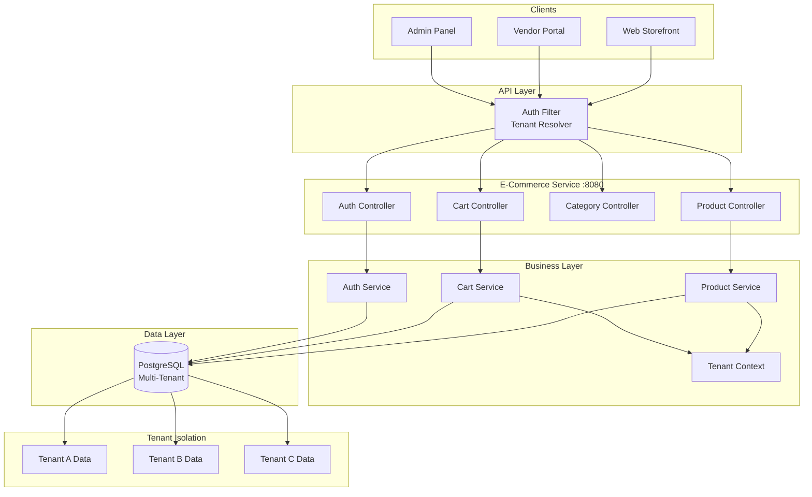

# Multi-Tenant E-Commerce API

[](https://openjdk.org/)
[](https://spring.io/projects/spring-boot)
[](https://www.postgresql.org/)
[](Dockerfile)
[](LICENSE)
[](https://github.com/jzavalaq/multitenant-ecommerce-api/actions/workflows/ci.yml)

> A multi-tenant e-commerce platform with vendor isolation, product variants, inventory management, and shopping cart functionality.

**Live Demo:** _Coming soon_ | **Swagger UI:** _Coming soon_

---

## Key Features

- **Multi-Tenancy**: Complete vendor data isolation with tenant context propagation
- **Product Management**: Products with variants (SKU, price, stock), categories, and inventory tracking
- **Shopping Cart**: Real-time stock validation, bulk operations, cart persistence
- **Role-Based Access Control**: Admin, Vendor, and Customer roles with fine-grained permissions
- **JWT Authentication**: Secure token-based auth with tenant-bound tokens
- **Database Indexing**: Optimized queries with proper entity indexes

---

## Architecture



---

## Multi-Tenancy Strategy

This implementation uses **shared database with discriminator column** approach:

| Strategy | Description |
|----------|-------------|
| **Shared Database** | All tenants share the same database |
| **Tenant ID Column** | Each table has `tenant_id` for data isolation |
| **Context Propagation** | Tenant resolved from JWT token or request header |
| **Query Filtering** | Automatic tenant filtering in repository queries |

### Tenant Resolution Flow

1. Request arrives with JWT token
2. Token contains `tenant_slug` claim
3. `TenantContext` stores current tenant
4. Repository queries automatically filter by tenant

---

## Architectural Decisions

| Decision | Rationale |
|----------|-----------|
| **Shared Database** | Cost-effective for SaaS, simpler maintenance |
| **Tenant ID Column** | Clean data isolation without schema complexity |
| **Product Variants** | Flexible SKU management with stock tracking |
| **Cart Persistence** | Database-backed cart survives session timeout |
| **RBAC with Tenant** | Roles scoped per tenant for vendor isolation |

---

## Tech Stack

| Technology | Version | Purpose |
|------------|---------|---------|
| Java | 21 | Runtime environment |
| Spring Boot | 3.2.5 | Application framework |
| Spring Data JPA | 3.2.5 | Data persistence |
| Spring Security | 6.x | Authentication & authorization |
| PostgreSQL | 15+ | Production database |
| H2 | 2.x | Development database |
| JWT (jjwt) | 0.12.5 | Token-based authentication |
| Flyway | 10.x | Database migrations |
| SpringDoc OpenAPI | 2.5.0 | API documentation |

---

## Quick Start

### Option 1: Docker Compose (Recommended)

```bash
# Clone the repository
git clone https://github.com/jzavalaq/multitenant-ecommerce-api.git
cd multitenant-ecommerce-api

# Copy environment file
cp .env.example .env

# Start all services
docker-compose up -d

# View logs
docker-compose logs -f app
```

Services available:
- **API:** http://localhost:8080
- **Swagger UI:** http://localhost:8080/swagger-ui.html
- **Health Check:** http://localhost:8080/actuator/health

### Option 2: Local Development (H2)

```bash
# Build and run with H2
mvn spring-boot:run -Dspring-boot.run.profiles=dev

# H2 Console: http://localhost:8080/h2-console
# JDBC URL: jdbc:h2:mem:ecommerce
```

---

## API Examples

### Authentication

```bash
# Register a new user (creates tenant context)
curl -X POST http://localhost:8080/api/v1/auth/register \
  -H "Content-Type: application/json" \
  -d '{
    "email": "vendor@example.com",
    "password": "SecurePass123!",
    "tenantSlug": "acme-store",
    "role": "VENDOR"
  }'

# Login (tenant required)
curl -X POST http://localhost:8080/api/v1/auth/login \
  -H "Content-Type: application/json" \
  -d '{
    "email": "vendor@example.com",
    "password": "SecurePass123!",
    "tenantSlug": "acme-store"
  }'
```

### Products

```bash
TOKEN="your-jwt-token"

# List products (tenant-filtered)
curl -X GET "http://localhost:8080/api/v1/products?page=0&size=20" \
  -H "Authorization: Bearer $TOKEN"

# Create product with variants
curl -X POST http://localhost:8080/api/v1/products \
  -H "Authorization: Bearer $TOKEN" \
  -H "Content-Type: application/json" \
  -d '{
    "name": "Wireless Headphones",
    "description": "Premium noise-canceling headphones",
    "categoryId": 1,
    "variants": [
      {"sku": "WH-BLK-001", "price": 99.99, "stock": 100},
      {"sku": "WH-WHT-001", "price": 99.99, "stock": 50}
    ]
  }'
```

### Shopping Cart

```bash
# Get cart
curl -X GET http://localhost:8080/api/v1/cart \
  -H "Authorization: Bearer $TOKEN"

# Add item to cart
curl -X POST http://localhost:8080/api/v1/cart/items \
  -H "Authorization: Bearer $TOKEN" \
  -H "Content-Type: application/json" \
  -d '{
    "variantId": 1,
    "quantity": 2
  }'

# Update quantity
curl -X PUT "http://localhost:8080/api/v1/cart/items/1?quantity=3" \
  -H "Authorization: Bearer $TOKEN"

# Remove item
curl -X DELETE http://localhost:8080/api/v1/cart/items/1 \
  -H "Authorization: Bearer $TOKEN"
```

---

## Configuration

### Environment Variables

| Variable | Description | Default |
|----------|-------------|---------|
| `DB_URL` | PostgreSQL connection URL | `jdbc:postgresql://localhost:5432/ecommerce` |
| `DB_USERNAME` | Database username | `ecommerce_user` |
| `DB_PASSWORD` | Database password | _Required_ |
| `JWT_SECRET` | JWT signing key (256+ bits) | _Required_ |
| `ALLOWED_ORIGINS` | CORS allowed origins | `http://localhost:3000` |

---

## Project Structure

```
src/main/java/com/jzavalaq/ecommerce/
├── config/          # Security, multi-tenancy configuration
├── controller/      # REST API endpoints
├── service/         # Business logic
├── repository/      # Data access with tenant filtering
├── entity/          # JPA entities (Product, Variant, Cart, Tenant)
├── dto/             # Request/Response DTOs
├── security/        # JWT authentication, tenant resolution
└── exception/       # Custom exceptions
```

---

## Testing

```bash
# Run all tests
mvn test

# Run with coverage
mvn test jacoco:report
```

---

## License

This project is licensed under the MIT License - see the [LICENSE](LICENSE) file for details.

---

## Author

**Juan Zavala** - [GitHub](https://github.com/jzavalaq) - [LinkedIn](https://linkedin.com/in/juanzavalaq)
